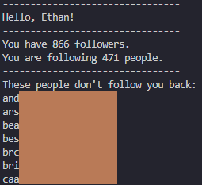

# InstagramFollowers

C++ program to find determine Instagram Mutuals.

Tired of seeing your follower count go down while you still follow the same amount of people? Who are these fakes?
This program takes two txt file lists of your followers and your following on Instagram, and then tells you who does not follow back.

Then you can happily unfollow the people who think that they deserve fans. :heart:

### Areas of Improvement
- Utilize a Script to automatically download Follower and Following Data
- Unfollow any non-mutuals using Instagram API
